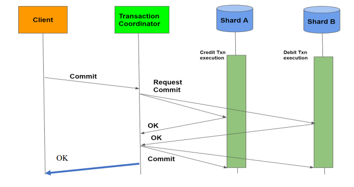

# Trabalho de Computação Distribuída utilizando Sockets

## Alunos: Diogo Leite / Jonathas Borges

* O projeto implementa um sistema distribuído de coordenação de transações. Consiste em um cliente, um coordenador de transações e dois servidores de banco de dados (Shard A e Shard B). O cliente inicia uma transação enviando uma solicitação ao coordenador, que coordena as operações de crédito e débito nos servidores de banco de dados. 

